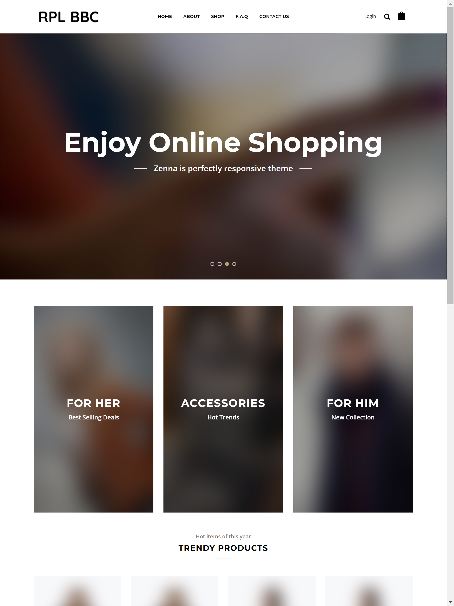
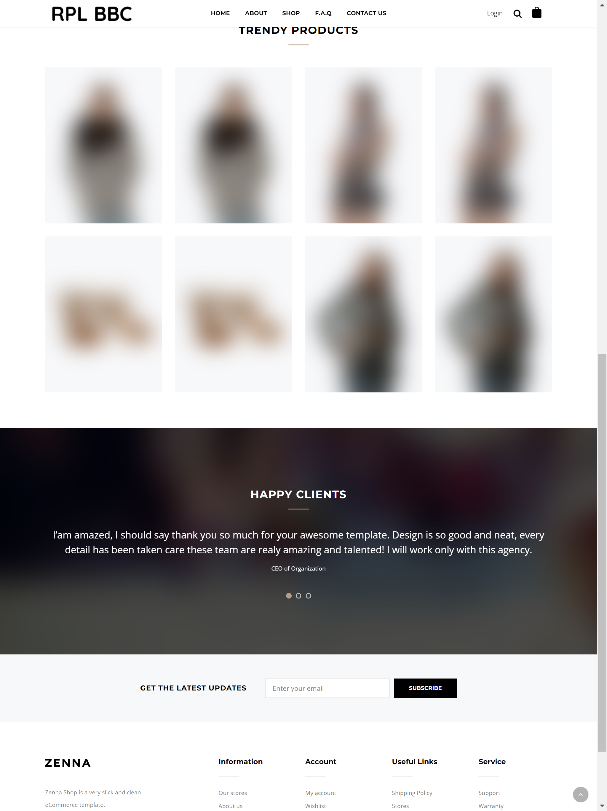
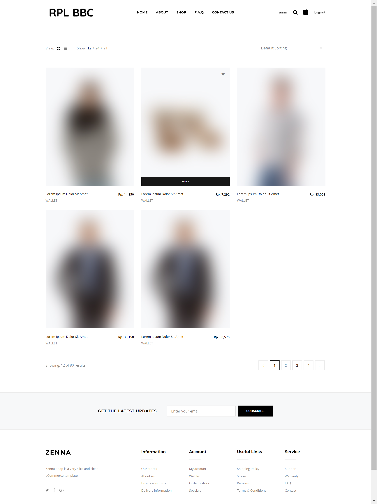
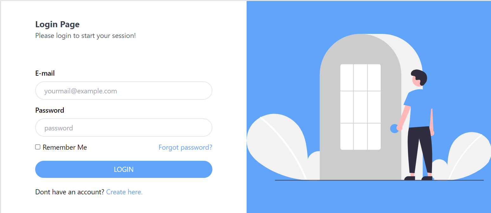
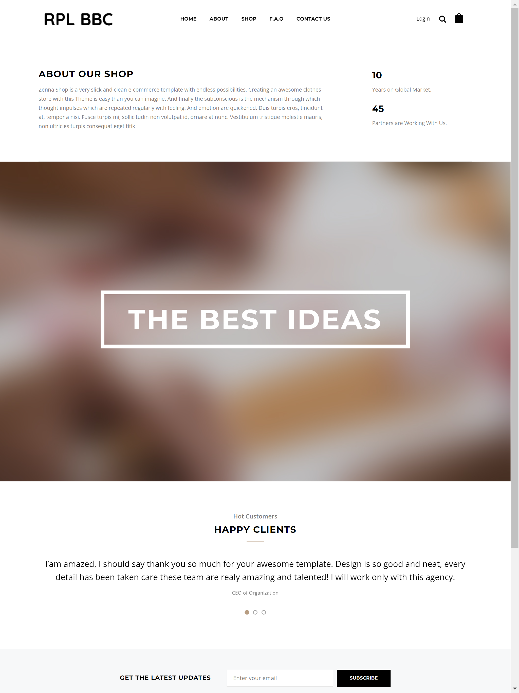
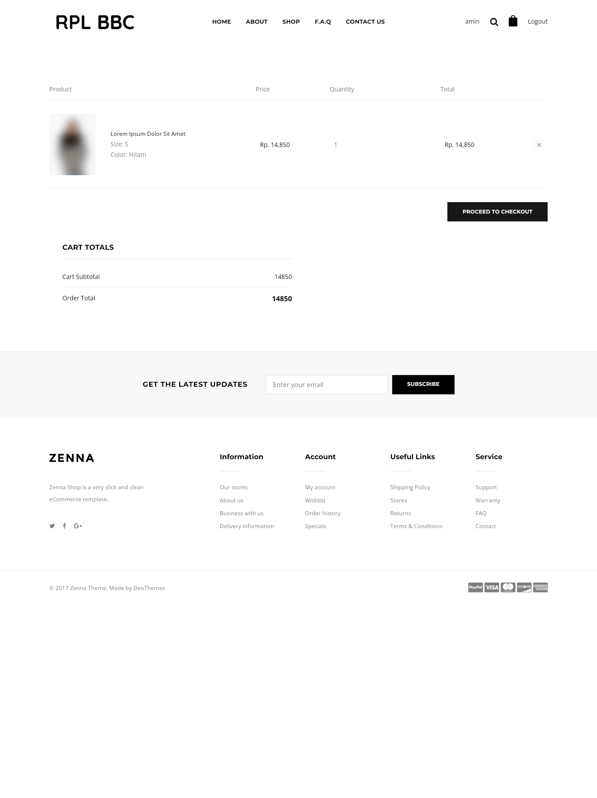
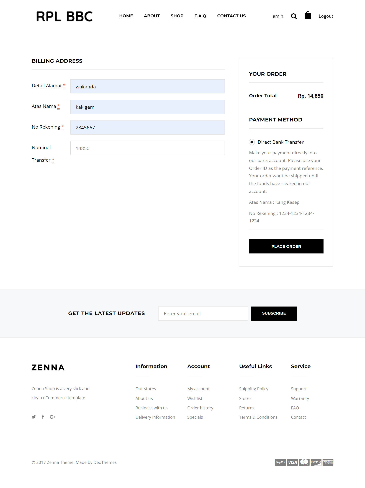
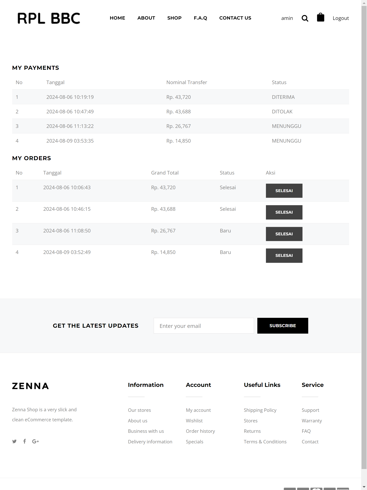

<p align="center"><a href="https://laravel.com" target="_blank"></a></p>

<p align="center">
<a href="https://travis-ci.org/laravel/framework"></a>
<a href="https://packagist.org/packages/laravel/framework"></a>
<a href="https://packagist.org/packages/laravel/framework"></a>
<a href="https://packagist.org/packages/laravel/framework"></a>
</p>

=======
# E-commerce with Laravel

Project ini adalah aplikasi website E-commerce yang dibangun menggunakan Laravel. Website ini dirancang untuk memungkinkan pengguna melakukan transaksi jual beli online dengan berbagai fitur seperti:

- Manajemen kategori dan subkategori produk
- Autentikasi login dan registrasi ubtuk user
- Pengelolaan produk dan gambar
- Fitur admin untuk kontrol penuh atas konten

## Prerequisites

- PHP 7.4 or higher
- Composer 2.4.1
- Laravel  8
- MySQL atau database lain yang didukung oleh Laravel
- Laragon (optional, but recommended for local development)

## Steps Installation

1. **Clone the repository:**

    ```bash
    git clone https://github.com/minchen11/E-commerce.git
    cd e-commerce
    ```

2. **Install dependencies:**

    ```bash
    composer install or composer update (if composer already installed)
    ```

3. **Copy the `.env.example` file to `.env` modify the environment variables**

    ```bash
    cp .env.example .env
    ```

4. **Update file `.env` file with your database credentials and other necessary configurations**

    ```bash
    DB_CONNECTION=mysql
    DB_HOST=127.0.0.1
    DB_PORT=3306
    DB_DATABASE="YOUR DATABASE NAME"
    DB_USERNAME=root
    DB_PASSWORD=
    ```

5. **Generate kunci aplikasi:**

    ```bash
    php artisan key:generate
    ```

6. **Generate an application key:**

    ```bash
    php artisan key:generate
    ```

7. **Jalankan migrasi:**

    ```bash
    php artisan migrate
    ```

8. **Isi database (opsional):**

    ```bash
    php artisan db:seed
    ```

9. **Mulai server pengembangan:**

    ```bash
    php artisan serve
    ```

Aplikasi Anda sekarang seharusnya berjalan di [http://localhost:8000](http://localhost:8000).

## Teknologi yang Digunakan

- **Laravel 8.0**: Framework PHP untuk membangun aplikasi web yang efisien.
- **MySQL**: Database relasional untuk menyimpan data aplikasi.
- **Bootstrap 4**: Framework CSS untuk desain responsif.
- **JWT (JSON Web Token)**: Sistem otentikasi untuk API.

## Screenshot

Berikut adalah beberapa tangkapan layar dari aplikasi:

### Halaman Utama




### Halaman Shop



### Halaman login dan registrasi user




### Halaman About



### Halaman Checkout







# Support Me

Jika tutorial dan proyek yang saya bagikan di sini bermanfaat bagi Anda, pertimbangkan untuk mendukung saya melalui Saweria. Dukungan Anda akan membantu saya untuk terus membuat dan memperbarui konten yang berguna. Terima kasih atas dukungan Anda!

Kunjungi [Saweria](https://saweria.co/snowkel) untuk mendukung kami!
